# AWS 3-Tier Architecture Project

## 📌 Project Overview

This project demonstrates the deployment of a Production-Ready AWS Three-Tier Architecture using Amazon Web Services. The architecture follows best practices by separating the Web, Application, and Database layers into different subnets for improved security, scalability, and high availability.

## 🛠️ AWS Services Used

- Amazon VPC
- Public & Private Subnets
- Internet Gateway (IGW)
- NAT Gateway
- Route Tables
- Security Groups
- Amazon EC2
- Application Load Balancer (ALB)
- Target Groups
- Auto Scaling Groups (ASG)
- Launch Templates
- Amazon RDS (MySQL)
- Custom AMIs

## 🏗️ Architecture

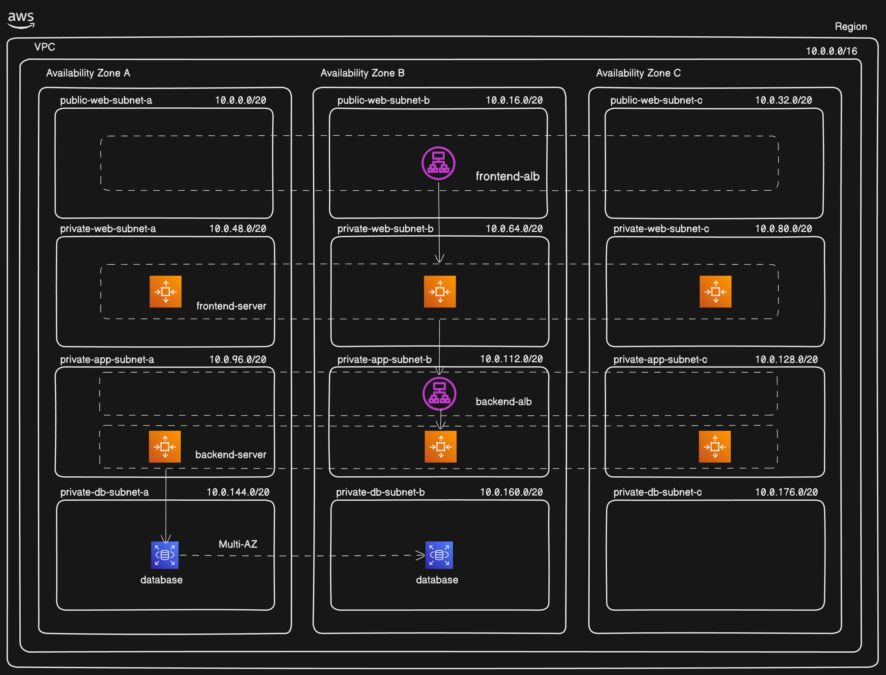

## 📷 Project Screenshots

### VPC
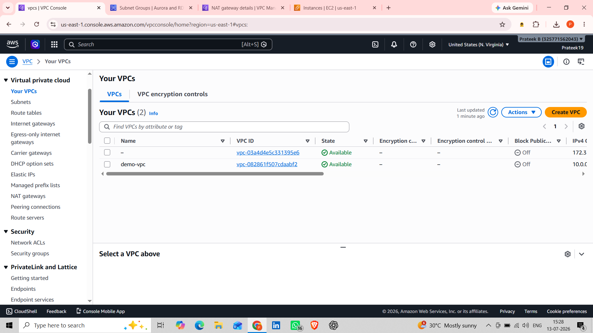

### Subnets
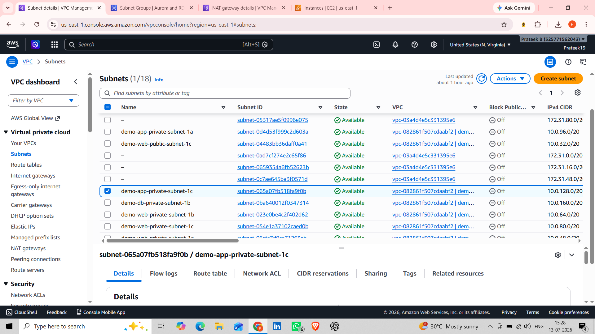

### Route Tables
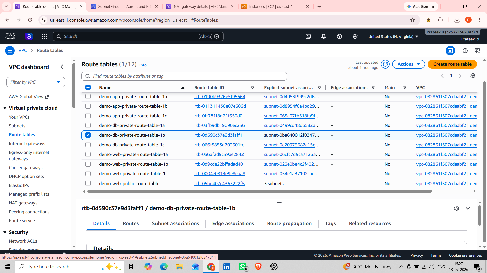

### Internet Gateway
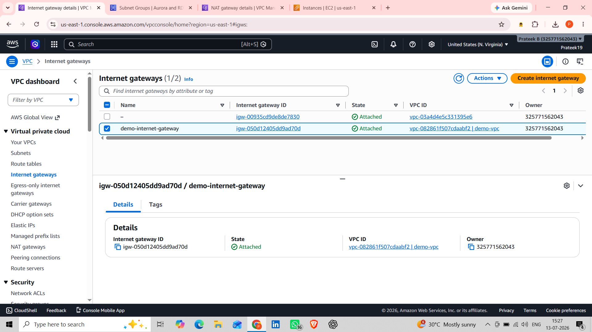

### NAT Gateway
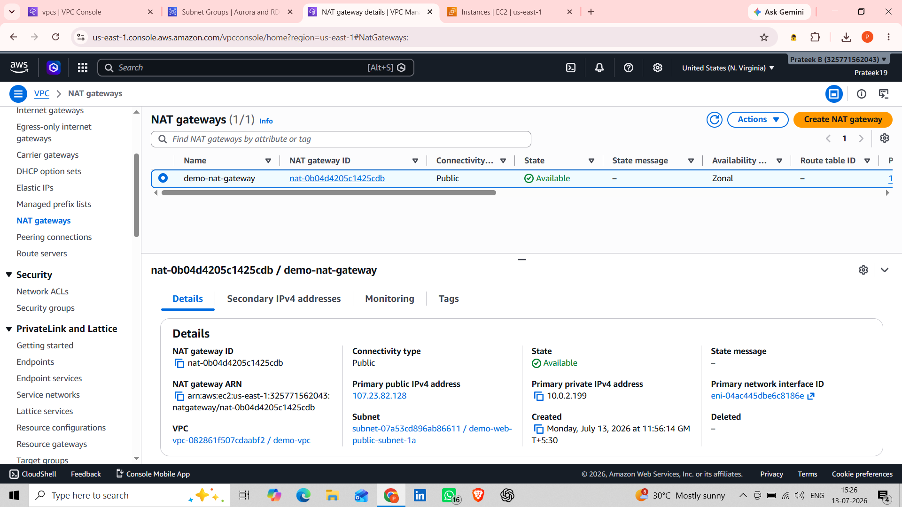

### Security Groups
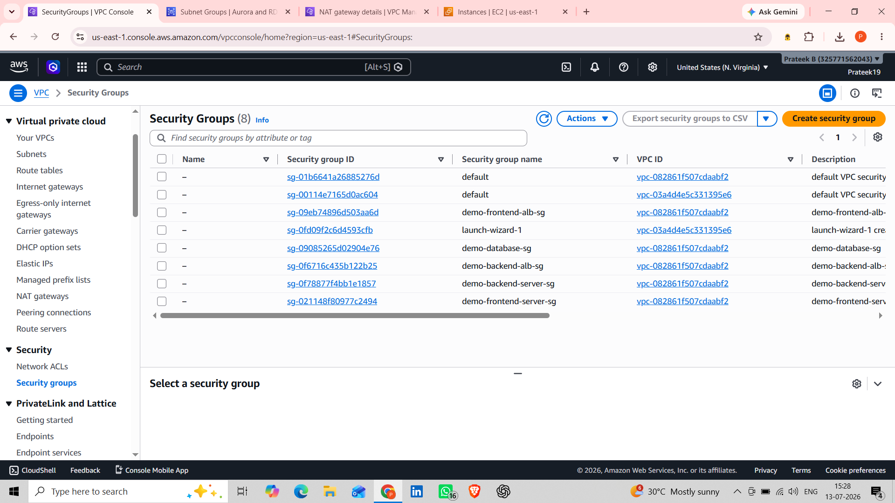

### Application Load Balancer
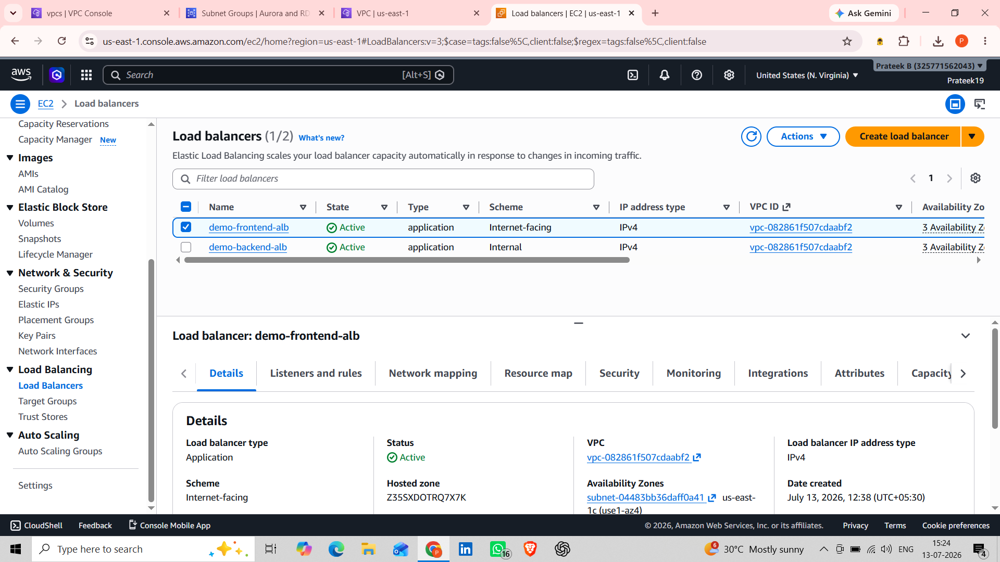

### Target Groups
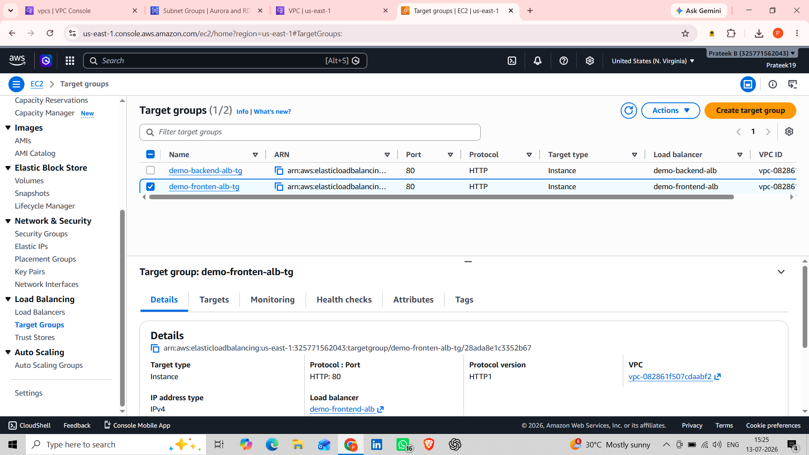

### Launch Templates
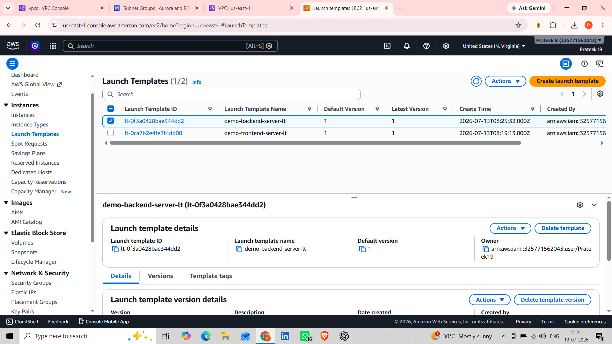

### Auto Scaling Groups
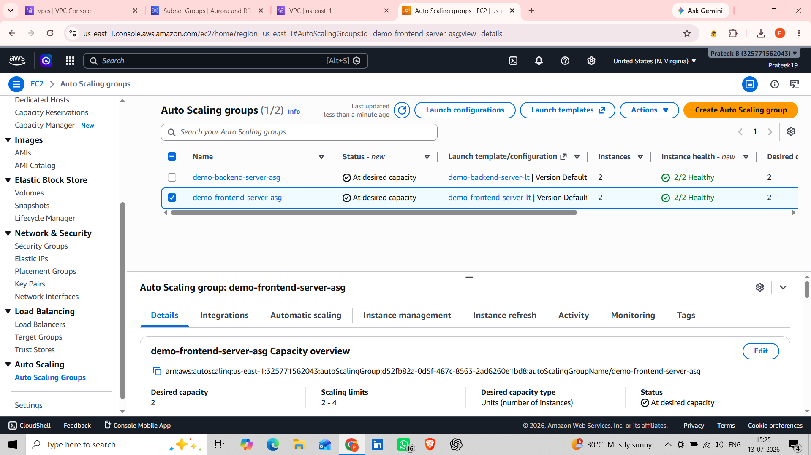

### EC2 Instances
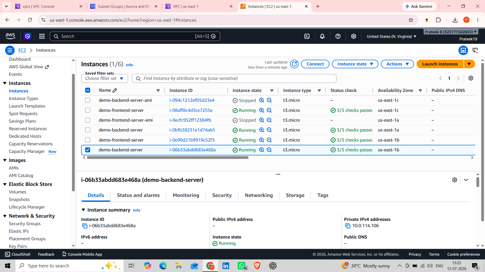

### DB Subnet Group
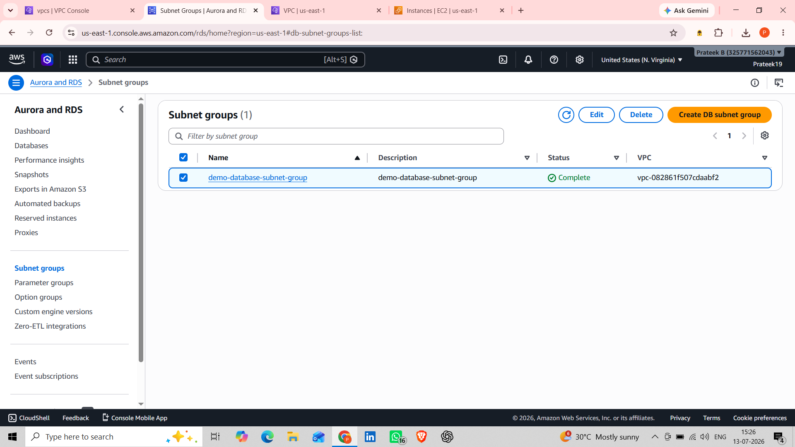

### RDS Database
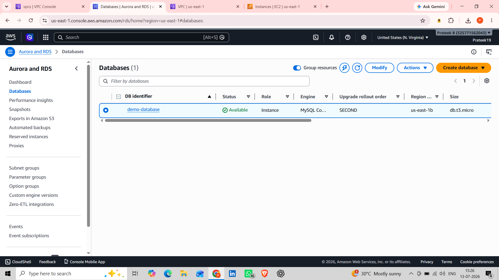

### Final Working Application
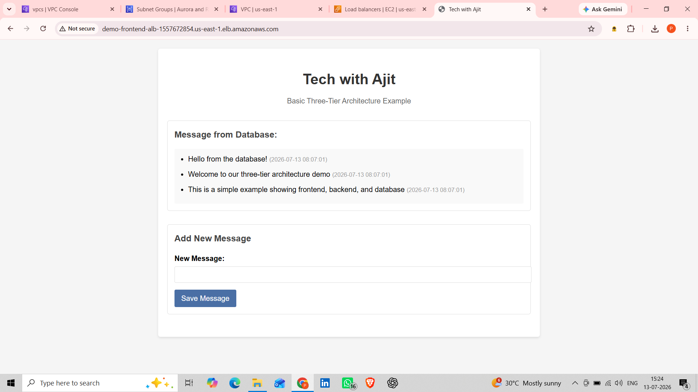

## 🚀 Features

- Highly Available Architecture
- Secure Networking
- Public and Private Subnets
- Load Balanced Web Tier
- Auto Scaling EC2 Instances
- Private Database Layer
- Production-Style Infrastructure

## 📚 Skills Learned

- AWS Networking
- VPC Design
- EC2 Management
- Application Load Balancer
- Auto Scaling
- RDS Deployment
- Security Groups
- Route Tables
- NAT Gateway Configuration

## 👨‍💻 Author

Prateek K B
